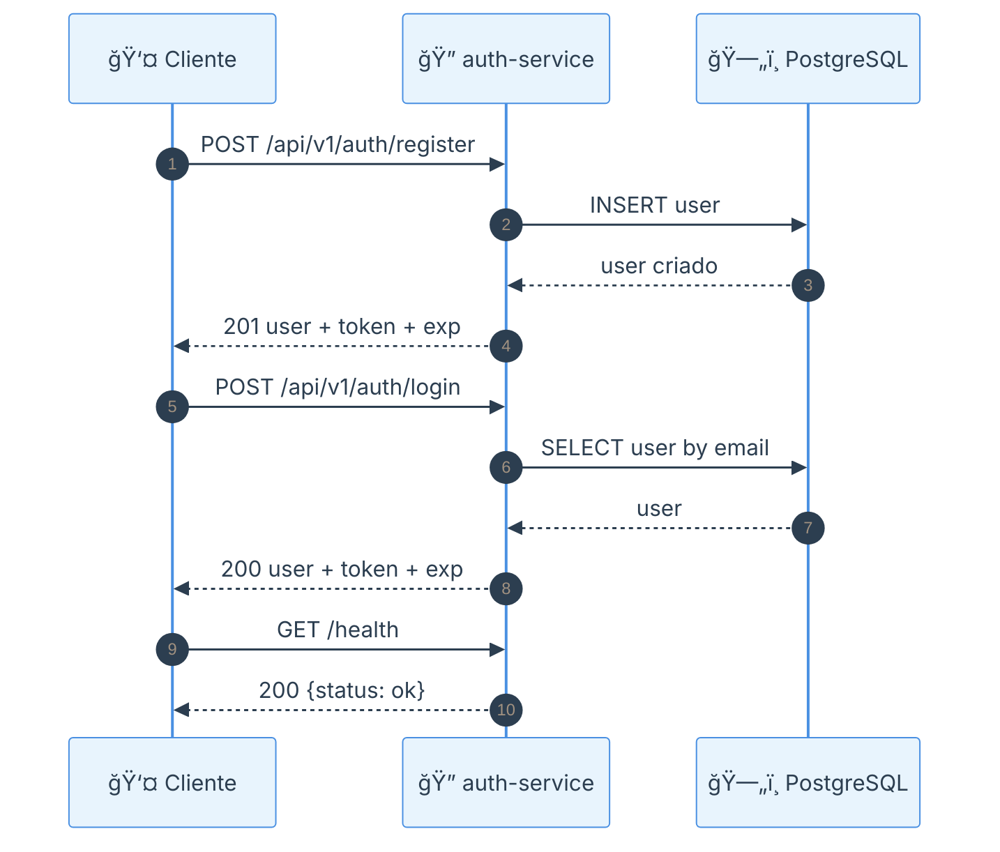
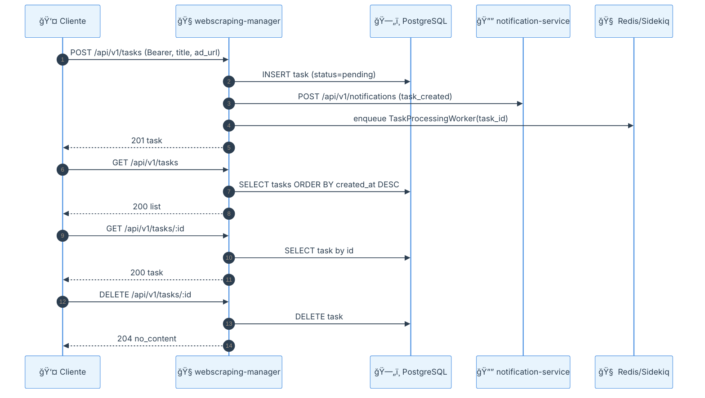
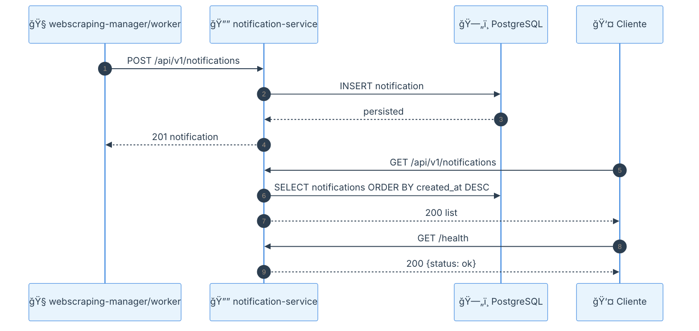

```mermaid
%%{init: {
	'theme':'base',
	'themeVariables': {
		'primaryColor':'#E8F4FD',
		'primaryBorderColor':'#4A90E2',
		'primaryTextColor':'#2C3E50',
		'secondaryColor':'#F0F8E8',
		'tertiaryColor':'#FDF2E8',
		'quaternaryColor':'#F8E8F8',
		'lineColor':'#5D6D7E',
		'fontFamily':'Inter,Segoe UI,Arial'
	}
}}%%
graph TB
	subgraph ClientSide["Consumo"]
		CLI["ğŸ–¥ï¸ Navegador (UI Web)"]
	end

	subgraph CoreServices["Microsserviços Rails"]
		AUTH["🔠auth-service"]
		MANAGER["🧭 webscraping-manager"]
		PROC["ğŸ•·ï¸ processing-service"]
		NOTIF["🔔 notification-service"]
		SIDEKIQ["âš™ï¸ webscraping-manager-sidekiq"]
	end

	subgraph Infra["Infraestrutura"]
		PG[("ğŸ—„ï¸ PostgreSQL")]
		REDIS[("🧠 Redis")]
		WEB["🌠Webmotors"]
	end

	CLI -->|"telas web + ações"| MANAGER
	MANAGER -->|"registro/login"| AUTH
	MANAGER -->|"CRUD task"| PG
	MANAGER -->|"enfileira job"| REDIS
	REDIS -->|"consome fila"| SIDEKIQ
	SIDEKIQ -->|"scrape task"| PROC
	PROC -->|"raspa anúncio"| WEB
	PROC -->|"retorna brand/model/price"| SIDEKIQ
	SIDEKIQ -->|"atualiza task"| MANAGER
	SIDEKIQ -->|"publica evento"| NOTIF
	AUTH -->|"users"| PG
	NOTIF -->|"notifications"| PG
```

```mermaid
%%{init: {
	'theme':'base',
	'themeVariables': {
		'primaryColor':'#E8F4FD',
		'primaryBorderColor':'#4A90E2',
		'primaryTextColor':'#2C3E50',
		'secondaryColor':'#F0F8E8',
		'tertiaryColor':'#FDF2E8',
		'quaternaryColor':'#F8E8F8',
		'lineColor':'#5D6D7E',
		'fontFamily':'Inter,Segoe UI,Arial'
	}
}}%%
sequenceDiagram
	autonumber
	participant Q as 🧠 Sidekiq Queue
	participant W as ⚙️ TaskProcessingWorker
	participant DB as 🗄️ PostgreSQL
	participant P as 🕷️ processing-service
	participant N as 🔔 notification-service

	Q->>W: perform(task_id)
	W->>DB: find task
	alt task inexistente ou terminal
		W-->>Q: return
	else task pendente
		W->>DB: update status=processing
		W->>P: POST /api/v1/scrape (task_id, ad_url)
		alt status == completed
			P-->>W: {status, brand, model, price}
			W->>DB: update status=completed + dados + completed_at
			W->>N: POST notification (task_completed)
		else erro/falha
			P-->>W: {status=failed, error_message}
			W->>DB: update status=failed + error_message + completed_at
			W->>N: POST notification (task_failed)
		end
	end
```

```mermaid
%%{init: {
	'theme':'base',
	'themeVariables': {
		'primaryColor':'#E8F4FD',
		'primaryBorderColor':'#4A90E2',
		'primaryTextColor':'#2C3E50',
		'secondaryColor':'#F0F8E8',
		'tertiaryColor':'#FDF2E8',
		'quaternaryColor':'#F8E8F8',
		'lineColor':'#5D6D7E',
		'fontFamily':'Inter,Segoe UI,Arial'
	}
}}%%
sequenceDiagram
	autonumber
	participant W as ⚙️ Worker (manager)
	participant P as 🕷️ processing-service
	participant S as 🌐 Site alvo (Webmotors)

	W->>P: POST /api/v1/scrape (task_id, ad_url)
	P->>S: GET ad_url
	S-->>P: HTML
	P->>P: parse Nokogiri
	alt sucesso
		P-->>W: 200 {status: completed, brand, model, price, error_message: null}
	else falha
		P-->>W: 200 {status: failed, error_message}
	end

	W->>P: GET /health
	P-->>W: 200 {status: ok}
```

# c2s-webscraping-rails

Ecossistema de microsserviços em Ruby on Rails para gerenciamento de tarefas de web scraping de anúncios de veículos, com autenticação via JWT, processamento assíncrono com Sidekiq e registro de notificações de ciclo de vida.

Este repositório atende ao escopo do teste técnico em `tests/Dev Backend Pleno Rails - Teste Técnico.md`.

## 🏗️ Arquitetura



## 🔁 Diagramas de Sequência

<details>
	<summary><strong>auth-service (registro e login)</strong></summary>



</details>

<details>
	<summary><strong>webscraping-manager (API de tasks)</strong></summary>



</details>

<details>
	<summary><strong>webscraping-manager-sidekiq (worker assíncrono)</strong></summary>



</details>

<details>
	<summary><strong>processing-service (scrape)</strong></summary>



</details>

<details>
	<summary><strong>notification-service (eventos)</strong></summary>



</details>

## 🧩 Serviços

- 🧭 `webscraping-manager`: UI web mínima + API de tarefas (`create`, `index`, `show`, `destroy`).
- ⚙️ `webscraping-manager-sidekiq`: worker dedicado para processamento assíncrono de tarefas.
- 🔐 `auth-service`: registro/login e emissão de JWT com expiração.
- 🕷️ `processing-service`: scraping com Nokogiri/HTTP e retorno padronizado (`completed`/`failed`).
- 🔔 `notification-service`: persistência e listagem de eventos (`task_created`, `task_completed`, `task_failed`).
- 🗄️ Infra compartilhada: `postgres` + `redis`.

## 🧱 Stack

- 💎 Ruby on Rails
- 🗄️ PostgreSQL
- 🧠 Redis + ⚙️ Sidekiq
- 🔐 JWT
- 🕸️ Nokogiri
- 🌐 HTTParty
- 🐳 Docker Compose
- 🧪 RSpec + 🧹 Rubocop

## 🗂️ Estrutura do projeto

```text
.
├── auth-service/
├── notification-service/
├── processing-service/
├── webscraping-manager/
├── docker-compose.yml
└── README.md
```

## ✅ Pré-requisitos

- 🐳 Docker
- 🧩 Docker Compose

## ⚙️ Variáveis de ambiente

Cada serviço possui `.env.example` com os valores necessários:

- 🔐 `auth-service/.env.example`
- 🔔 `notification-service/.env.example`
- 🕷️ `processing-service/.env.example`
- 🧭 `webscraping-manager/.env.example`

## ▶️ Como executar (um comando)

Na raiz deste repositório (`src/c2s-webscraping-rails`):

```bash
docker compose up -d
```

O compose sobe:

- 🧭 `webscraping-manager` (host `3000`)
- 🔐 `auth-service` (host `3001`)
- 🔔 `notification-service` (host `3002`)
- 🕷️ `processing-service` (host `3003`)
- ⚙️ `webscraping-manager-sidekiq`
- 🗄️ `postgres` (host `55432`, container `5432`)
- 🧠 `redis` (host `6379`)

## 🗄️ Preparar banco

Após subir os containers, executar:

```bash
docker compose exec auth-service bundle exec rails db:prepare
docker compose exec notification-service bundle exec rails db:prepare
docker compose exec webscraping-manager bundle exec rails db:prepare
```

## 🩺 Health checks

```bash
curl http://localhost:3000/health
curl http://localhost:3001/health
curl http://localhost:3002/health
curl http://localhost:3003/health
```

Resposta esperada:

```json
{"status":"ok"}
```

## 🔌 Endpoints principais (MVP)

### auth-service

- `POST /api/v1/auth/register`
- `POST /api/v1/auth/login`
- `GET /health`

### webscraping-manager (API)

- `POST /api/v1/tasks`
- `GET /api/v1/tasks`
- `GET /api/v1/tasks/:id`
- `DELETE /api/v1/tasks/:id`
- `GET /health`

### webscraping-manager (Web UI)

- `GET /login`
- `POST /login`
- `GET /register`
- `POST /register`
- `GET /tasks`
- `GET /tasks/:id`
- `DELETE /tasks/:id`
- `DELETE /logout`

### processing-service

- `POST /api/v1/scrape`
- `GET /health`

### notification-service

- `POST /api/v1/notifications`
- `GET /api/v1/notifications`
- `GET /health`

## 🔄 Fluxo funcional resumido

1. 👤 Usuário registra/login no `webscraping-manager` (via `auth-service`).
2. 📝 Usuário cria tarefa de scraping.
3. 🧭 `webscraping-manager` cria task `pending` e enfileira job.
4. ⚙️ `webscraping-manager-sidekiq` chama `processing-service`.
5. ✅/❌ Task vai para `completed` (com `brand/model/price`) ou `failed` (com `error_message`).
6. 🔔 Evento é publicado no `notification-service`.

## 🧪 Testes

Executar por serviço:

```bash
cd auth-service && bundle exec rspec
cd notification-service && bundle exec rspec
cd processing-service && bundle exec rspec
cd webscraping-manager && bundle exec rspec
```

Exemplo de foco no fluxo assíncrono do manager:

```bash
cd webscraping-manager
bundle exec rspec spec/requests/api/v1/task_lifecycle_spec.rb spec/requests/api/v1/tasks_spec.rb spec/workers/task_processing_worker_spec.rb
```

## 🧹 Lint

```bash
cd auth-service && bundle exec rubocop
cd notification-service && bundle exec rubocop
cd processing-service && bundle exec rubocop
cd webscraping-manager && bundle exec rubocop
```

## 📚 Documentação de apoio

- 📐 Especificação técnica: `outputs/c2s-webscraping-rails-rails-specification.md`
- 🧭 Plano de implementação: `outputs/c2s-webscraping-rails-rails-implementation-steps.md`
- 🧪 Enunciado do teste: `tests/Dev Backend Pleno Rails - Teste Técnico.md`


## 🔗 Referências

* [webscraping-manager](https://github.com/enogrob/webscraping-manager)
* [processing-service](https://github.com/enogrob/processing-service)
* [notification-service](https://github.com/enogrob/notification-service)
* [auth-service](https://github.com/enogrob/auth-service)
* [Dev Backend Pleno Rails - Teste Técnico](refs/Dev%20Backend%20Pleno%20Rails%20-%20Teste%20Técnico.md)

