```mermaid
%%{init: {
	'theme':'base',
	'themeVariables': {
		'primaryColor':'#E8F4FD',
		'primaryBorderColor':'#4A90E2',
		'primaryTextColor':'#2C3E50',
		'secondaryColor':'#F0F8E8',
		'tertiaryColor':'#FDF2E8',
		'quaternaryColor':'#F8E8F8',
		'lineColor':'#5D6D7E',
		'fontFamily':'Inter,Segoe UI,Arial'
	}
}}%%
sequenceDiagram
	autonumber
	participant C as 👤 Cliente
	participant M as 🧭 webscraping-manager
	participant DB as 🗄️ PostgreSQL
	participant N as 🔔 notification-service
	participant R as 🧠 Redis/Sidekiq

	C->>M: POST /api/v1/tasks (Bearer, title, ad_url)
	M->>DB: INSERT task (status=pending)
	M->>N: POST /api/v1/notifications (task_created)
	M->>R: enqueue TaskProcessingWorker(task_id)
	M-->>C: 201 task

	C->>M: GET /api/v1/tasks
	M->>DB: SELECT tasks ORDER BY created_at DESC
	M-->>C: 200 list

	C->>M: GET /api/v1/tasks/:id
	M->>DB: SELECT task by id
	M-->>C: 200 task

	C->>M: DELETE /api/v1/tasks/:id
	M->>DB: DELETE task
	M-->>C: 204 no_content
```

```mermaid
%%{init: {
	'theme':'base',
	'themeVariables': {
		'primaryColor':'#E8F4FD',
		'primaryBorderColor':'#4A90E2',
		'primaryTextColor':'#2C3E50',
		'secondaryColor':'#F0F8E8',
		'tertiaryColor':'#FDF2E8',
		'quaternaryColor':'#F8E8F8',
		'lineColor':'#5D6D7E',
		'fontFamily':'Inter,Segoe UI,Arial'
	}
}}%%
sequenceDiagram
	autonumber
	participant Q as 🧠 Sidekiq Queue
	participant W as ⚙️ TaskProcessingWorker
	participant DB as 🗄️ PostgreSQL
	participant P as 🕷️ processing-service
	participant N as 🔔 notification-service

	Q->>W: perform(task_id)
	W->>DB: find task
	alt task inexistente ou terminal
		W-->>Q: return
	else task pendente
		W->>DB: update status=processing
		W->>P: POST /api/v1/scrape (task_id, ad_url)
		alt status == completed
			P-->>W: {status, brand, model, price}
			W->>DB: update status=completed + dados + completed_at
			W->>N: POST notification (task_completed)
		else erro/falha
			P-->>W: {status=failed, error_message}
			W->>DB: update status=failed + error_message + completed_at
			W->>N: POST notification (task_failed)
		end
	end
```

```mermaid
%%{init: {
	'theme':'base',
	'themeVariables': {
		'primaryColor':'#E8F4FD',
		'primaryBorderColor':'#4A90E2',
		'primaryTextColor':'#2C3E50',
		'secondaryColor':'#F0F8E8',
		'tertiaryColor':'#FDF2E8',
		'quaternaryColor':'#F8E8F8',
		'lineColor':'#5D6D7E',
		'fontFamily':'Inter,Segoe UI,Arial'
	}
}}%%
sequenceDiagram
	autonumber
	participant W as ⚙️ Worker (manager)
	participant P as 🕷️ processing-service
	participant S as 🌐 Site alvo (Webmotors)

	W->>P: POST /api/v1/scrape (task_id, ad_url)
	P->>S: GET ad_url
	S-->>P: HTML
	P->>P: parse Nokogiri
	alt sucesso
		P-->>W: 200 {status: completed, brand, model, price, error_message: null}
	else falha
		P-->>W: 200 {status: failed, error_message}
	end

	W->>P: GET /health
	P-->>W: 200 {status: ok}
```

# c2s-webscraping-rails

Ecossistema de microsserviços em Ruby on Rails para gerenciamento de tarefas de web scraping de anúncios de veículos, com autenticação via JWT, processamento assíncrono com Sidekiq e registro de notificações de ciclo de vida.

Este repositório atende ao escopo do teste técnico em `tests/Dev Backend Pleno Rails - Teste Técnico.md`.

## 🏗️ Arquitetura


## 🔁 Diagramas de Sequência

```mermaid
%%{init: {
	'theme':'base',
	'themeVariables': {
		'primaryColor':'#E8F4FD',
		'primaryBorderColor':'#4A90E2',
		'primaryTextColor':'#2C3E50',
		'secondaryColor':'#F0F8E8',
		'tertiaryColor':'#FDF2E8',
		'quaternaryColor':'#F8E8F8',
		'lineColor':'#5D6D7E',
		'fontFamily':'Inter,Segoe UI,Arial'
	}
}}%%
sequenceDiagram
	autonumber
	participant C as 👤 Cliente
	participant A as 🔐 auth-service
	participant DB as 🗄️ PostgreSQL

	C->>A: POST /api/v1/auth/register
	A->>DB: INSERT user
	DB-->>A: user criado
	A-->>C: 201 user + token + exp

	C->>A: POST /api/v1/auth/login
	A->>DB: SELECT user by email
	DB-->>A: user
	A-->>C: 200 user + token + exp

	C->>A: GET /health
	A-->>C: 200 {status: ok}
```

<details>
	<summary><strong>auth-service (registro e login)</strong></summary>



</details>

<details>
	<summary><strong>webscraping-manager (API de tasks)</strong></summary>



</details>

<details>
	<summary><strong>webscraping-manager-sidekiq (worker assíncrono)</strong></summary>



</details>

<details>
	<summary><strong>processing-service (scrape)</strong></summary>



</details>

<details>
	<summary><strong>notification-service (eventos)</strong></summary>



</details>

```mermaid
%%{init: {
	'theme':'base',
	'themeVariables': {
		'primaryColor':'#E8F4FD',
		'primaryBorderColor':'#4A90E2',
		'primaryTextColor':'#2C3E50',
		'secondaryColor':'#F0F8E8',
		'tertiaryColor':'#FDF2E8',
		'quaternaryColor':'#F8E8F8',
		'lineColor':'#5D6D7E',
		'fontFamily':'Inter,Segoe UI,Arial'
	}
}}%%
sequenceDiagram
	autonumber
	participant M as 🧭 webscraping-manager/worker
	participant N as 🔔 notification-service
	participant DB as 🗄️ PostgreSQL
	participant C as 👤 Cliente

	M->>N: POST /api/v1/notifications
	N->>DB: INSERT notification
	DB-->>N: persisted
	N-->>M: 201 notification

	C->>N: GET /api/v1/notifications
	N->>DB: SELECT notifications ORDER BY created_at DESC
	N-->>C: 200 list

	C->>N: GET /health
	N-->>C: 200 {status: ok}
```

## 🧩 Serviços

- 🧭 `webscraping-manager`: UI web mínima + API de tarefas (`create`, `index`, `show`, `destroy`).
- ⚙️ `webscraping-manager-sidekiq`: worker dedicado para processamento assíncrono de tarefas.
- 🔐 `auth-service`: registro/login e emissão de JWT com expiração.
- 🕷️ `processing-service`: scraping com Nokogiri/HTTP e retorno padronizado (`completed`/`failed`).
- 🔔 `notification-service`: persistência e listagem de eventos (`task_created`, `task_completed`, `task_failed`).
- 🗄️ Infra compartilhada: `postgres` + `redis`.

## Stack

- Ruby on Rails
- PostgreSQL
- Redis + Sidekiq
- JWT
- Nokogiri
- HTTParty
- Docker Compose
- RSpec + Rubocop

## Estrutura do projeto

```text
.
├── auth-service/
├── notification-service/
├── processing-service/
├── webscraping-manager/
├── docker-compose.yml
└── README.md
```

## Pré-requisitos

- Docker
- Docker Compose

## Variáveis de ambiente

Cada serviço possui `.env.example` com os valores necessários:

- `auth-service/.env.example`
- `notification-service/.env.example`
- `processing-service/.env.example`
- `webscraping-manager/.env.example`

## Como executar (um comando)

Na raiz deste repositório (`src/c2s-webscraping-rails`):

```bash
docker compose up -d
```

O compose sobe:

- `webscraping-manager` (host `3000`)
- `auth-service` (host `3001`)
- `notification-service` (host `3002`)
- `processing-service` (host `3003`)
- `webscraping-manager-sidekiq`
- `postgres` (host `55432`, container `5432`)
- `redis` (host `6379`)

## Preparar banco

Após subir os containers, executar:

```bash
docker compose exec auth-service bundle exec rails db:prepare
docker compose exec notification-service bundle exec rails db:prepare
docker compose exec webscraping-manager bundle exec rails db:prepare
```

## Health checks

```bash
curl http://localhost:3000/health
curl http://localhost:3001/health
curl http://localhost:3002/health
curl http://localhost:3003/health
```

Resposta esperada:

```json
{"status":"ok"}
```

## Endpoints principais (MVP)

### auth-service

- `POST /api/v1/auth/register`
- `POST /api/v1/auth/login`
- `GET /health`

### webscraping-manager (API)

- `POST /api/v1/tasks`
- `GET /api/v1/tasks`
- `GET /api/v1/tasks/:id`
- `DELETE /api/v1/tasks/:id`
- `GET /health`

### webscraping-manager (Web UI)

- `GET /login`
- `POST /login`
- `GET /register`
- `POST /register`
- `GET /tasks`
- `GET /tasks/:id`
- `DELETE /tasks/:id`
- `DELETE /logout`

### processing-service

- `POST /api/v1/scrape`
- `GET /health`

### notification-service

- `POST /api/v1/notifications`
- `GET /api/v1/notifications`
- `GET /health`

## Fluxo funcional resumido

1. Usuário registra/login no `webscraping-manager` (via `auth-service`).
2. Usuário cria tarefa de scraping.
3. `webscraping-manager` cria task `pending` e enfileira job.
4. `webscraping-manager-sidekiq` chama `processing-service`.
5. Task vai para `completed` (com `brand/model/price`) ou `failed` (com `error_message`).
6. Evento é publicado no `notification-service`.

## Testes

Executar por serviço:

```bash
cd auth-service && bundle exec rspec
cd notification-service && bundle exec rspec
cd processing-service && bundle exec rspec
cd webscraping-manager && bundle exec rspec
```

Exemplo de foco no fluxo assíncrono do manager:

```bash
cd webscraping-manager
bundle exec rspec spec/requests/api/v1/task_lifecycle_spec.rb spec/requests/api/v1/tasks_spec.rb spec/workers/task_processing_worker_spec.rb
```

## Lint

```bash
cd auth-service && bundle exec rubocop
cd notification-service && bundle exec rubocop
cd processing-service && bundle exec rubocop
cd webscraping-manager && bundle exec rubocop
```

## Documentação de apoio

- Especificação técnica: `outputs/c2s-webscraping-rails-rails-specification.md`
- Plano de implementação: `outputs/c2s-webscraping-rails-rails-implementation-steps.md`
- Enunciado do teste: `tests/Dev Backend Pleno Rails - Teste Técnico.md`

## 🔗 Referências

* [webscraping-manager](https://github.com/enogrob/webscraping-manager)
* [processing-service](https://github.com/enogrob/processing-service)
* [notification-service](https://github.com/enogrob/notification-service)
* [auth-service](https://github.com/enogrob/auth-service)

